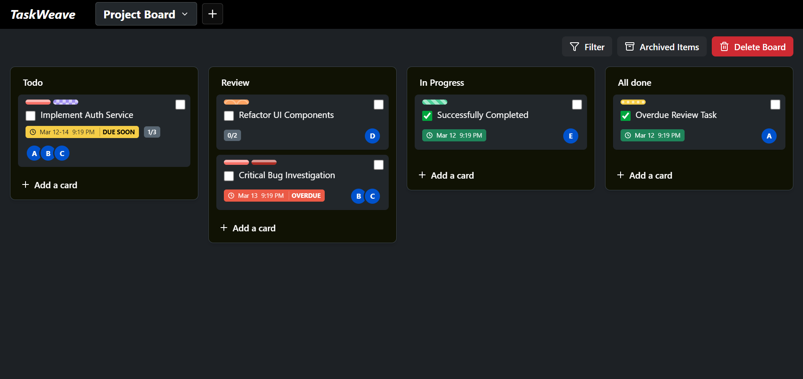
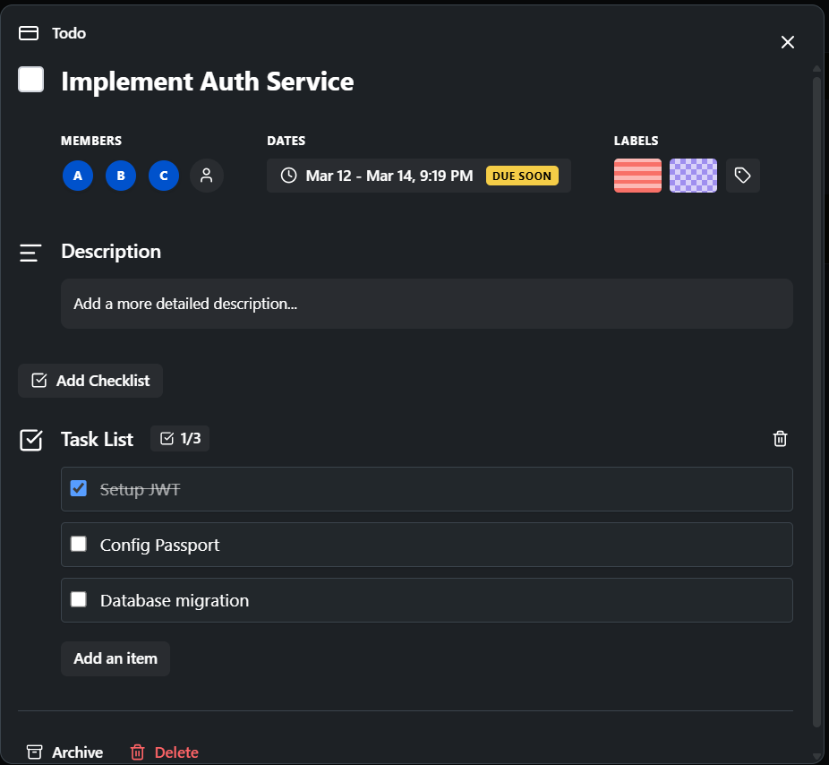
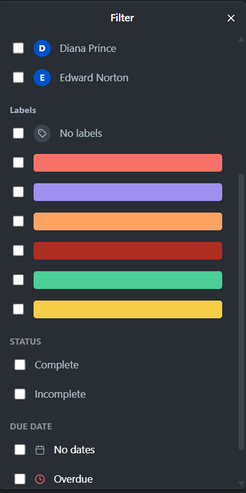
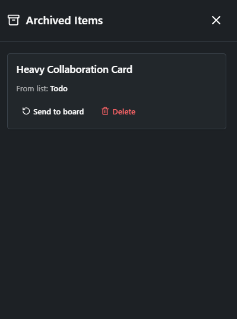

# TaskWeave

A full-stack **project management application inspired by Trello**, built with **Next.js, Express, and PostgreSQL**.

TaskWeave helps teams organize tasks using boards, lists, and cards with features such as drag-and-drop organization, task labeling, checklists, due dates, and filtering.

---

# Screenshots

## Dashboard / Board View
<p align="center">
  
</p>

## Card Details
<p align="center">
  
</p>

## Filtering Tasks
<p align="center">
  
</p>

## Archived Cards
<p align="center">
  
</p>


---

# Features

## Board Management

- Create project boards
- View lists and cards inside a board
- Delete boards and associated data

## List Management

- Create lists
- Edit list titles
- Delete lists
- Drag and drop lists to reorder

## Card Management

- Create cards inside lists
- Edit card titles and descriptions
- Drag cards within or across lists
- Archive cards
- Delete cards

## Card Productivity Tools

- Color coded labels
- Due dates
- Interactive checklists
- Assign members to cards

## Search and Filtering

- Search cards by title
- Filter cards by:
  - labels
  - members
  - due dates

## UI & Accessibility

- Dark themed interface
- Drag and drop interactions
- Colorblind friendly label patterns

---

# Tech Stack

## Frontend

- Next.js 16 (App Router)
- React 19
- Tailwind CSS 4
- Lucide React
- Hello Pangea DND

## Backend

- Node.js
- Express 5

## Database

- PostgreSQL
- pg (PostgreSQL client)

## Development Tools

- Nodemon

---

# Architecture

TaskWeave follows a **client-server architecture**.

### Frontend (Next.js)

Handles:

- UI rendering
- drag and drop interactions
- filtering
- card editing

### Backend (Express API)

Handles:

- REST API requests
- business logic
- database communication

### Database (PostgreSQL)

Stores:

- boards
- lists
- cards
- labels
- members
- checklist items

---

# API Endpoints

## Boards

```http
GET /api/boards
POST /api/boards
GET /api/boards/:id
DELETE /api/boards/:id
```

## Lists

```http
POST /api/lists
PATCH /api/lists/reorder
PATCH /api/lists/:id
DELETE /api/lists/:id
```

## Cards

```http
GET /api/cards/:id
POST /api/cards
PATCH /api/cards/:id
PATCH /api/cards/move
DELETE /api/cards/:id
```

### Additional Card Features
- Checklists
- Labels
- Member assignment
- Archived cards

Full implementations are inside: `server/routes`

---
## ⚠️ Deployment Note

The backend is hosted on the **Render free tier**.  
If the service has been inactive, the **first request may take 30–60 seconds** due to a cold start.

---

# Local Setup

## Prerequisites
- Node.js v18+
- PostgreSQL installed and running

## Database Setup

1. Create a database in PostgreSQL: `trello_clone`
2. Inside the `server` directory create a `.env` file.

```env
DB_USER=your_postgres_user
DB_HOST=localhost
DB_NAME=trello_clone
DB_PASSWORD=your_password
DB_PORT=5432
PORT=5000
```

## Install Dependencies

### Backend
```bash
cd server
npm install
```

### Frontend
```bash
cd client
npm install
```

## Seed Database
```bash
cd server
npm run seed
```

## Run Backend
```bash
cd server
npm run dev
```
Backend runs at `http://localhost:5000`

## Run Frontend
```bash
cd client
npm run dev
```
Frontend runs at `http://localhost:3000`

---

# Future Improvements

- File attachments on cards
- Activity logs
- Card comments
- Board background customization
- Real-time collaboration
- Notifications
